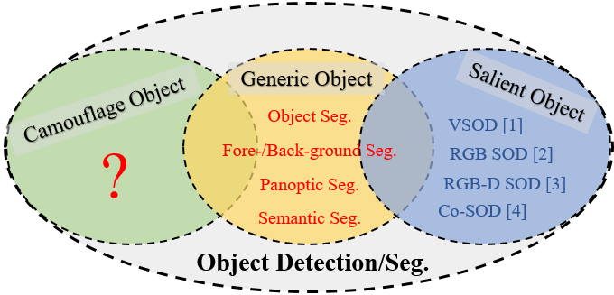
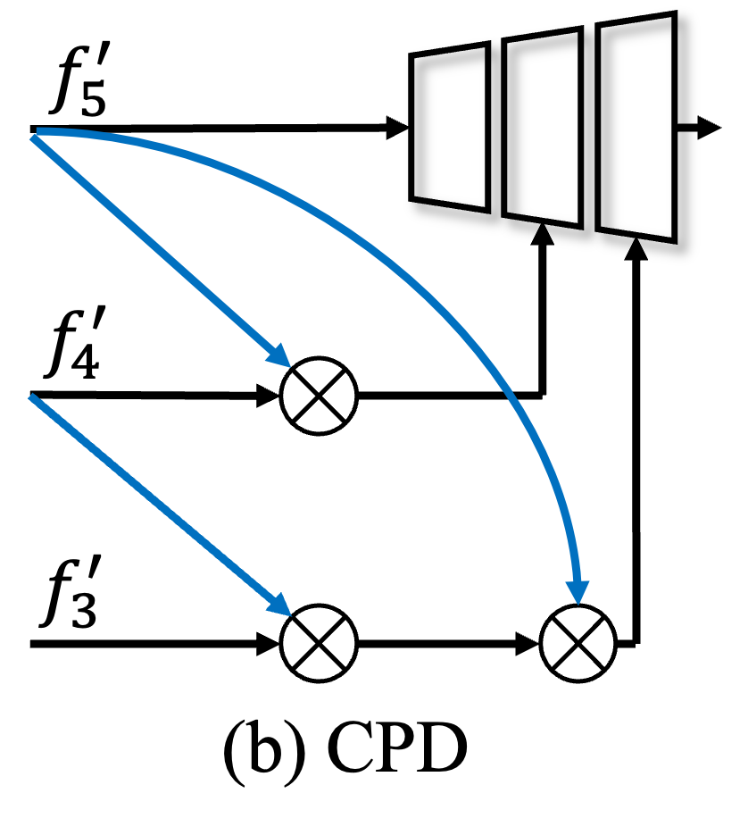

# 
`Concealed Object Detection (IEEE TPAMI)`

PyTorch implementation of our extended model, termed as Search and Identification Network (SINet-V2), for the COD task.

> **Authors:** 
> [Deng-Ping Fan](https://dengpingfan.github.io/), 
> [Ge-Peng Ji](https://github.com/GewelsJI), 
> [Ming-Ming Cheng*](https://mmcheng.net/) &
> [Ling Shao](http://www.inceptioniai.org/).

## 1. Features

- Here is a toy example for our task. Could you find camouflaged objects in this video?

    https://user-images.githubusercontent.com/38354957/201454018-f59b0b91-c952-4af3-8828-802fd1490453.mp4

- **Introduction.** This repository contains the source code, prediction results, and evaluation toolbox of our Search and Identification Network, also called SINet-V2 ([arXiv](http://dpfan.net/wp-content/uploads/ConcealedOD_paper.pdf) / [SuppMaterial](http://dpfan.net/wp-content/uploads/ConcealedOD_supp.pdf) / [ProjectPage](http://dpfan.net/Camouflage/))
, which are the journal extension version of our paper SINet ([github](https://github.com/DengPingFan/SINet) /
[pdf](https://openaccess.thecvf.com/content_CVPR_2020/papers/Fan_Camouflaged_Object_Detection_CVPR_2020_paper.pdf)) published at CVPR-2020.

- **Highlights.** Compared to our conference version, we achieve new SOTA in the field of COD via the two 
well-elaborated sub-modules, including neighbor connection decoder (NCD) and group-reversal attention (GRA). 
Please refer to our paper for more details.

      

> If you have any questions about our paper, feel free to contact me via e-mail (gepengai.ji@gmail.com). 
> And if you are using our code and evaluation toolbox for your research, please cite this paper ([BibTeX](#4-citation)).

## 2. :fire: NEWS :fire:

- [2023/08/01] Update all expired onedirve download links, now all files are available at google drive.
- [2022/11/13] We create an awesome paper list ([link](https://github.com/GewelsJI/SINet-V2/blob/main/AWESOME_COD_LIST.md)) for our camouflaged object detection community. 
- [2021/12/26] :fire: < Concealed Object Detection > 论文在[Jittor Developer Conference 2021](https://cg.cs.tsinghua.edu.cn/jittor/news/2021-12-27-15-27-00-00-jdc1/)中荣获「优秀计图论文奖」
- [2021/12/14] :fire: 恭喜四川大学[傅可人教授团队](http://www.kerenfu.top/)的课题「面向工业质检的通用缺陷检测模型」基于SINetV2模型作为分割基线模型，参与“中信银行杯”第三届中国研究生人工智能创新大赛并取得喜人成绩.「[初赛企业组赛题-总排名第一](https://cpipc.acge.org.cn//cw/detail/2c9088a5696cbf370169a3f8101510bd/2c9080147c35e5a8017c5e7e939c43d6) 和 [总决赛-二等奖](https://cpipc.acge.org.cn//cw/detail/2c9088a5696cbf370169a3f8101510bd/2c90800c7da2aae7017db76b3abf07c6)」
- [2021/10/10] Delivering a spotlight presentation 「伪装目标检测技术及其应用」 in VALSE 2021. The poster file can be found at [link (paper id-31)](http://valser.org/2021/#/poster).
- [2021/10/09] Note that there are two images (`COD10K-CAM-1-Aquatic-3-Crab-32.png` and `COD10K-CAM-2-Terrestrial-23-Cat-1506.png`) that overlap between the training and test set of COD10K. You can either keep or discard those two images because they only slightly affect the final performance (~0.1% changes in terms of different metrics).
- [2021/07/20] HUAWEI 藤蔓技术论坛2021 Talk: “伪装目标检测技术与应用”，报告人：范登平，2021. （[PPT下载](http://dpfan.net/wp-content/uploads/IIAI-%E4%BC%AA%E8%A3%85%E7%9B%AE%E6%A0%87%E6%A3%80%E6%B5%8B%E6%8A%80%E6%9C%AF%E4%B8%8E%E5%BA%94%E7%94%A8-V6.pptx)）
- [2021/06/16] Updating the latest download link ([Pytorch](https://drive.google.com/file/d/1I3vKdcjafkTb2U2pOke07khurXxqLpzR/view?usp=sharing) / [Jittor](https://drive.google.com/file/d/13DeX-IMFE6u0TnNG5blUvHzo5o21cVpc/view?usp=sharing)) on four testing dataset, including CHAMELEON, CAMO, COD10K, and NC4K.
- [2021/06/11] :fire: 「图形与几何计算」公众号报道：[计图开源：隐蔽目标检测新任务在计图框架下推理性能大幅提升](https://cg.cs.tsinghua.edu.cn/jittor/news/2021-06-11-00-00-cod/)。 
- [2021/06/05] The [Jittor conversion of SINet-V2 (inference code)](https://github.com/GewelsJI/SINet-V2/tree/main/jittor) is available right now.
  It has robust inference efficiency compared to PyTorch version, please enjoy it. 
  Many thanks to Yu-Cheng Chou for the excellent conversion from PyTorch framework)
- [2021/06/01] :fire: Our **TPAMI paper** is early access to [IEEE Xplore](https://ieeexplore.ieee.org/document/9444794).
- [2021/05/18] 机器之心走近全球顶尖实验室系列之「伪装目标检测：挑战、方法和应用」视频报告分享([链接](https://app6ca5octe2206.pc.xiaoe-tech.com/detail/v_60a36389e4b0adb2d8652c35/3))。
- [2021/05/16] [Jittor](https://cg.cs.tsinghua.edu.cn/jittor/) code will come soon ...
- [2021/05/01] Updating the download link of training/testing dataset in our experiments.
- [2021/04/20] The release of inference map on the [2021-CVPR-NC4K](https://github.com/JingZhang617/COD-Rank-Localize-and-Segment) test dataset, which can be downloaded from the [Google Drive](https://drive.google.com/file/d/1ux2-eDSaAu0EcEV-s04s5u-H27W5siFx/view?usp=sharing).
- [2021/02/21] Uploading the whole project.
- [2021/01/16] Creating repository.

## 3. Overview

      
    <em> 
    Figure 1: Task relationship. One of the most popular directions in computer vision is generic object detection. 
    Note that generic objects can be either salient or camouflaged; camouflaged objects can be seen as difficult cases of 
    generic objects. Typical generic object detection tasks include semantic segmentation and panoptic 
    segmentation (see Fig. 2 b).
    </em>

      
    <em> 
    Figure 2: Given an input image (a), we present the ground-truth for (b) panoptic segmentation 
    (which detects generic objects including stuff and things), (c) salient instance/object detection 
    (which detects objects that grasp human attention), and (d) the proposed camouflaged object detection task, 
    where the goal is to detect objects that have a similar pattern (e.g., edge, texture, or color) to the natural habitat. 
    In this case, the boundaries of the two butterflies are blended with the bananas, making them difficult to identify. 
    This task is far more challenging than the traditional salient object detection or generic object detection.
    </em>

> References of Salient Object Detection (SOD) benchmark works 
> [1] Video SOD: Shifting More Attention to Video Salient Object Detection. CVPR, 2019. ([Project Page](http://dpfan.net/davsod/)) 
> [2] RGB SOD: Salient Objects in Clutter: Bringing Salient Object Detection to the Foreground. ECCV, 2018. ([Project Page](https://dpfan.net/socbenchmark/)) 
> [3] RGB-D SOD: Rethinking RGB-D Salient Object Detection: Models, Datasets, and Large-Scale Benchmarks. TNNLS, 2020. ([Project Page](http://dpfan.net/d3netbenchmark/)) 
> [4] Co-SOD: Taking a Deeper Look at the Co-salient Object Detection. CVPR, 2020. ([Project Page](http://dpfan.net/CoSOD3K/))

## 4. Proposed Framework

### 4.1. Training/Testing

The training and testing experiments are conducted using [PyTorch](https://github.com/pytorch/pytorch) with 
a single GeForce RTX TITAN GPU of 24 GB Memory.

> Note that our model also supports low memory GPU, which means you should lower the batch size.

1. Prerequisites:
   
    Note that SINet-V2 is only tested on Ubuntu OS with the following environments. 
    It may work on other operating systems (i.e., Windows) as well but we do not guarantee that it will.
    
    + Creating a virtual environment in terminal: `conda create -n SINet python=3.6`.
    
    + Installing necessary packages: [PyTorch > 1.1](https://pytorch.org/), [opencv-python](https://pypi.org/project/opencv-python/)

1. Prepare the data:

    + downloading testing dataset and moving it into `./Dataset/TestDataset/`, 
    which can be found in [Google Drive](https://drive.google.com/file/d/1V0iSEdYJrT0Y_DHZfVGMg6TySFRNTy4o/view?usp=sharing).

    + downloading training/validation dataset and move it into `./Dataset/TrainValDataset/`, 
    which can be found in [Google Drive](https://drive.google.com/file/d/1M8-Ivd33KslvyehLK9_IUBGJ_Kf52bWG/view?usp=sharing)
    
    + downloading pre-trained weights and move it into `./snapshot/SINet_V2/Net_epoch_best.pth`, 
    which can be found in [Google Drive](https://drive.google.com/file/d/1D3RKQ8Nzd0ArV_c47StVKEuaoYTwnclR/view?usp=sharing).
    
    + downloading Res2Net weights on ImageNet dataset [download link (Google Drive)](https://drive.google.com/file/d/1QumnqSY_2wa-81-Ti0X1-jQzaGDIfa9r/view?usp=sharing).
   
1. Training Configuration:

    + Assigning your costumed path, like `--train_save` and `--train_path` in `MyTrain_Val.py`.
    
    + Just enjoy it via run `python MyTrain_Val.py` in your terminal.

1. Testing Configuration:

    + After you download all the pre-trained models and testing datasets, just run `MyTesting.py` to generate the final prediction map: 
    replace your trained model directory (`--pth_path`).
    
    + Just enjoy it!

### 3.2 Evaluating your trained model:

One-key evaluation is written in MATLAB code ([link](https://drive.google.com/file/d/1_h4_CjD5GKEf7B1MRuzye97H0MXf2GE9/view?usp=sharing)), 
please follow the instructions in `./eval/main.m` and just run it to generate the evaluation results in `./res/`.
The complete evaluation toolbox (including data, map, eval code, and res): [link](https://drive.google.com/file/d/1qga1UJlIQdHNlt_F9TdN4lmmOH4gN7l2/view?usp=sharing). 

### 3.3 Pre-computed maps: 
They can be found in download link([Pytorch results](https://drive.google.com/file/d/19s_jIMCgZxft2GXiomsMRF0SZLmP9FQ_/view?usp=sharing) / [Jittor results](https://drive.google.com/file/d/1cqAZSO3gpJALewJmP9OI1XRR6qX4NWwQ/view?usp=sharing)) on four testing dataset, including CHAMELEON, CAMO, COD10K, NC4K.

## 4. SOTA models
Link: [https://github.com/GewelsJI/SINet-V2/blob/main/AWESOME_COD_LIST.md](https://github.com/GewelsJI/SINet-V2/blob/main/AWESOME_COD_LIST.md)

## 5. Citation

If you find this project useful, please consider citing:
    
    @article{fan2021concealed,  
     author={Fan, Deng-Ping and Ji, Ge-Peng and Cheng, Ming-Ming and Shao, Ling},  
     title={Concealed Object Detection},   
     journal={IEEE TPAMI}, 
     year={2022},  
     volume={44},  
     number={10},  
     pages={6024-6042},  
     doi={10.1109/TPAMI.2021.3085766}
    }
    
    @inproceedings{fan2020camouflaged,
      title={Camouflaged object detection},
      author={Fan, Deng-Ping and Ji, Ge-Peng and Sun, Guolei and Cheng, Ming-Ming and Shen, Jianbing and Shao, Ling},
      booktitle={IEEE CVPR},
      pages={2777--2787},
      year={2020}
    }

## 6. FAQ

1. If the image cannot be loaded on the page (mostly in domestic network situations).

    [Solution Link](https://blog.csdn.net/weixin_42128813/article/details/102915578)

2. *Erratum:* The sub-figure (b) in Figure.17 of our paper is revised as follows. It shows that the decoder in 2019-CVPR-CPD builds the connection flow between $f’_5$ branch and $f’_4$ branch, rather than $f’_4$ branch and $f’_3$ branch.
   
   

      
    

    
## 7. License

The source code is free for research and education use only. Any commercial usage should get formal permission first.

---

**[⬆ back to top](#0-preface)**
